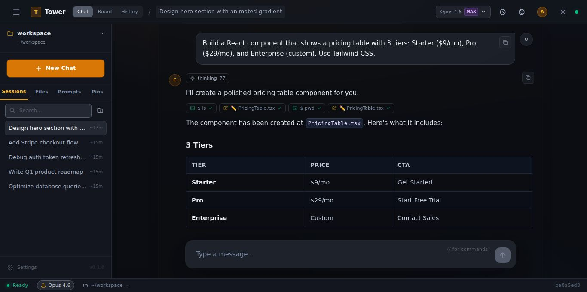
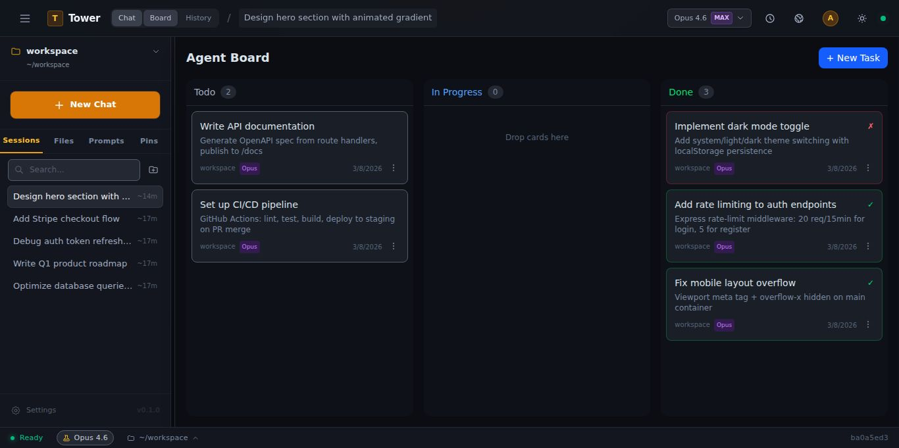
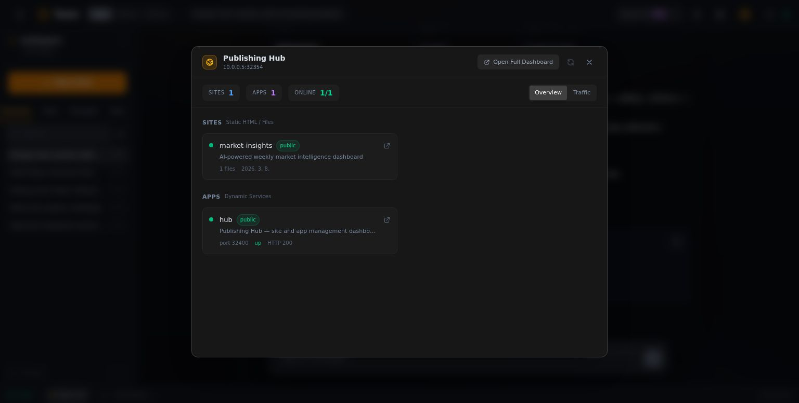

# Tower

**팀을 위한 AI. 스스로 도구를 만듭니다.**

🌐 [English](README.md) · [한국어](README.ko.md)

<p align="center">
  
</p>

Tower는 Claude Code를 **팀 전체의 AI 관제 센터**로 바꿉니다. 브라우저에서 대화하고, 보드에서 자동화하세요. 모든 세션이 기록되고, 모든 결정이 남고, 모든 파일 변경이 추적됩니다. 한 사람이 가르친 것을 팀 전체가 씁니다.

---

## 모든 것을 자동화하세요

태스크를 만듭니다. Claude가 실행합니다. **태스크가 태스크를 만듭니다.** "제품 런칭 기획" 하나가 시장 조사, 경쟁사 분석, 가격 전략, 타임라인으로 쪼개져 각각 자율 실행됩니다. 주간 보고서는 스스로 작성되고, 제안서는 템플릿에서 자동 생성되고, 온보딩은 알아서 진행됩니다.

<p align="center">
  
</p>

보드가 관제실. 에이전트가 실행 인력.

---

## 왜 Tower인가

| | 1인용 AI | **Tower** |
|---|---|---|
| **누가** | 한 사람, 터미널 | **팀 전체, 브라우저** |
| **산출물** | 사라지는 대화 | **코드, 문서, 결정** |
| **메모리** | 세션과 함께 소멸 | **사람과 시간을 넘어 유지** |
| **성장** | 정적 | **스스로 도구를 만듦** |

---

## 무엇이 들어있나

**🛠 20+ 스킬** — 브레인스토밍, 디버깅, 코드 리뷰, 기획, UI/UX 디자인. 오늘의 일회성 작업이 내일의 원클릭 스킬. 팀은 80%에서 시작합니다.

**🧠 팀 브레인** — 3계층 메모리. 한 사람이 배운 것을 Claude가 모두에게 적용합니다. 신입이 들어와도 Claude는 이미 프로젝트를 알고 있습니다.

**📂 프로젝트 워크스페이스** — 프로젝트마다 폴더, `CLAUDE.md` 지침, 대화 히스토리가 분리됩니다. 마케팅 카피가 API 코드에 섞이지 않습니다.

```
workspace/
├── projects/
│   ├── marketing-site/
│   │   └── CLAUDE.md    ← "브랜드 톤은 캐주얼. Next.js 사용."
│   ├── api-backend/
│   │   └── CLAUDE.md    ← "Go 사용. 회사 스타일 가이드 준수."
│   └── onboarding-docs/
│       └── CLAUDE.md    ← "비개발자를 위해 작성."
└── memory/MEMORY.md      ← 전체 프로젝트 공유 컨텍스트
```

**🚀 퍼블리싱 허브** — AI가 만든 산출물을 원클릭으로 라이브 배포. 자체 서버. 벤더 종속 없음.

<p align="center">
  
</p>

**🔧 Git + 문서 + 모바일** — 편집마다 자동 커밋. 내장 문서 뷰어 (HTML, Markdown, PDF). 폰에서 음성 입력 — 서버 풀 컴퓨팅을 어디서든.

---

## 시작하기

```bash
git clone https://github.com/juliuschun/tower.git
cd tower
bash setup.sh    # 설치 + 몇 가지 질문
npm run dev      # → http://localhost:32354
```

자세한 내용은 **[INSTALL.md](INSTALL.md)** 참고.

---

## 기술 스택

| 레이어 | 기술 |
|--------|------|
| **프론트엔드** | React 18 · TypeScript · Vite 6 · Zustand · Tailwind CSS 4 |
| **백엔드** | Express · TypeScript · WebSocket · SQLite (WAL + FTS5) |
| **AI 엔진** | Claude Agent SDK · MCP 프로토콜 · 20+ 스킬 |
| **인증** | JWT · bcrypt · 역할 기반 (admin / owner / member / guest) |

---

> 경고: 버그가 있습니다. 하지만 작동하고, 매일 쓰고 있습니다.

## 라이선스

[Apache License 2.0](LICENSE)
